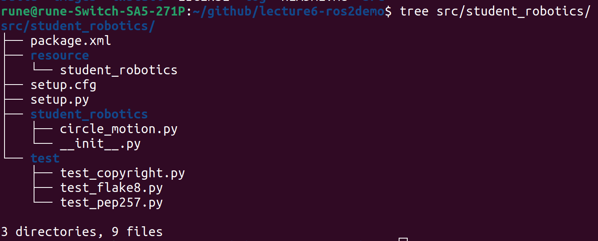
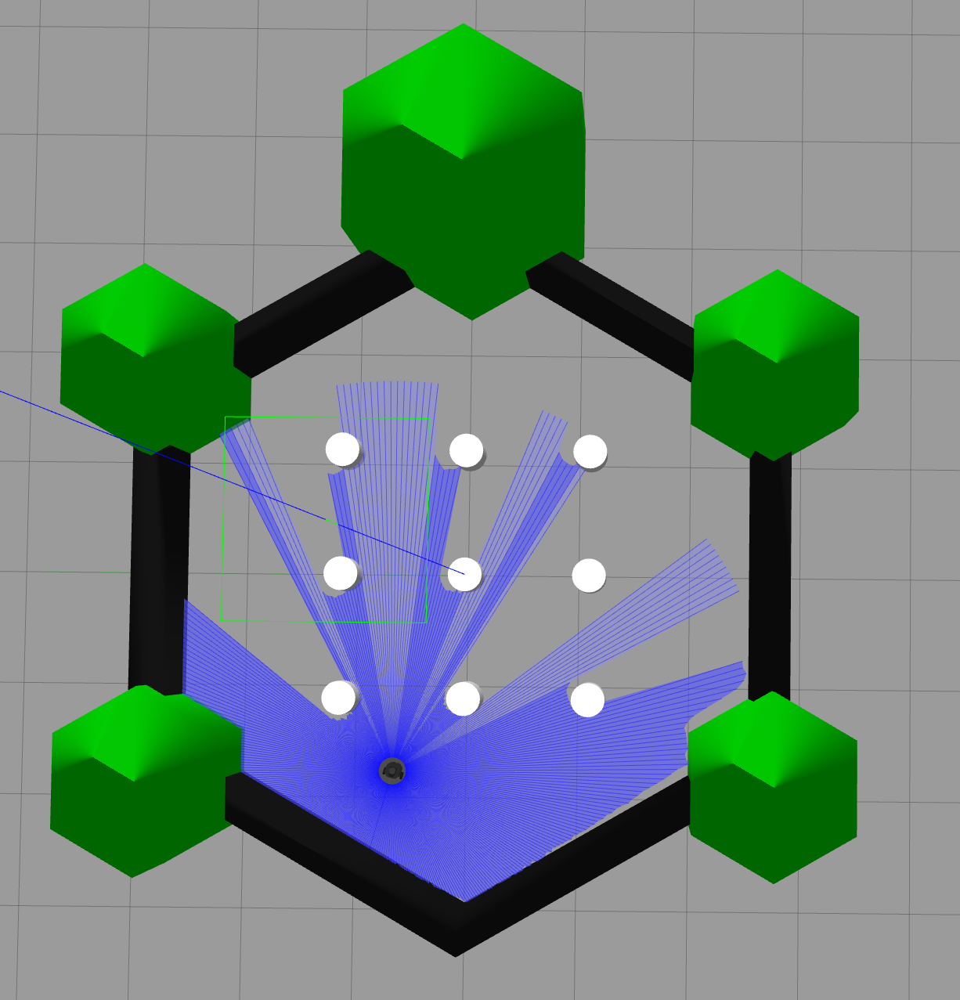

# Exercise 6: ROS 2 Concepts & Building Software Packages

[My fork](https://github.com/felixmerz00/lecture6-ros2demo), Felix Merz, student ID, ROS2 Humble

## Exercise 1
a)

```Python
import rclpy
from rclpy.node import Node
from geometry_msgs.msg import Twist

class TwistPublisher(Node):
    def __init__(self):
        super().__init__('twist_publisher')
        self.publisher = self.create_publisher(Twist, '/cmd_vel', 10)
        self.timer = self.create_timer(0.1, self.timer_callback)
    
    def timer_callback(self):
        msg = Twist()
        msg.linear.x = 0.3  # m/s forward
        msg.angular.z = 0.5     # rad/s turn
        self.publisher.publish(msg)
        

def main(args=None):
    rclpy.init(args=args)
    my_node = TwistPublisher()
    rclpy.spin(my_node)

    my_node.destroy_node()
    rclpy.shutdown()
```


`create_timer()` is an inherited method from the `Node` class that creates a timer that calls the provided callback method in the provided interval, i.e. it calls the `self.timer_callback` ten times per second. `self.timer_callback` publishes an instruction to move forward and turn, which the TurtleBot3 receives and follows.