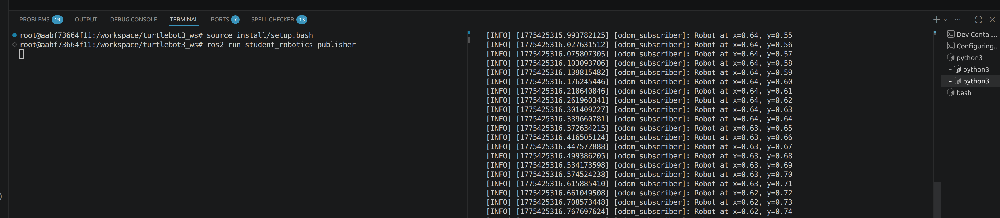
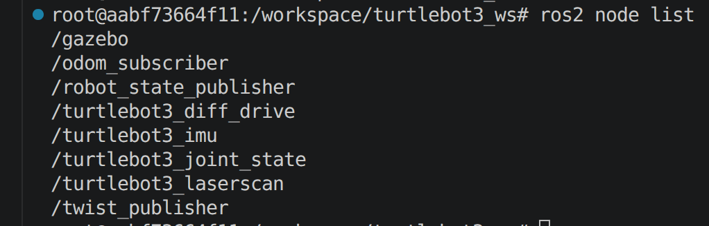
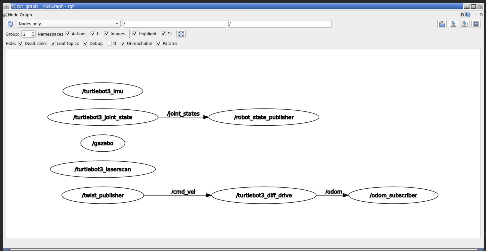

# Exercise 6: ROS 2 Concepts & Building Software Packages

[My fork](https://github.com/felixmerz00/lecture6-ros2demo), Felix Merz, 20-611-695, ROS2 Humble


## Exercise 1
### a)

```Python
import rclpy
from rclpy.node import Node
from geometry_msgs.msg import Twist

class TwistPublisher(Node):
    def __init__(self):
        super().__init__('twist_publisher')
        self.publisher = self.create_publisher(Twist, '/cmd_vel', 10)
        self.timer = self.create_timer(0.1, self.timer_callback)
    
    def timer_callback(self):
        msg = Twist()
        msg.linear.x = 0.3  # m/s forward
        msg.angular.z = 0.5     # rad/s turn
        self.publisher.publish(msg)
        

def main(args=None):
    rclpy.init(args=args)
    my_node = TwistPublisher()
    rclpy.spin(my_node)

    my_node.destroy_node()
    rclpy.shutdown()
```


`create_timer()` is an inherited method from the `Node` class that creates a timer that calls the provided callback method in the provided interval, i.e. it calls the `self.timer_callback` ten times per second. `self.timer_callback` publishes an instruction to move forward and turn, which the TurtleBot3 receives and follows.


### b)
Up until now I ran everything on my OS. I just now understood that I should run it in the provided Docker container.

```Python
import rclpy
from rclpy.node import Node
from nav_msgs.msg import Odometry

class OdomMonitor(Node):
    def __init__(self):
        super().__init__("odom_subscriber")
        self.subscription = self.create_subscription(Odometry, "/odom", self.odom_callback, 1)
        self.get_logger().info("Listening to odometry")
    
    def odom_callback(self, msg):
        pos = msg.pose.pose.position
        self.get_logger().info(
            f'Robot at x={pos.x:.2f}, y={pos.y:.2f}'
        )

def main(args=None):
    rclpy.init(args=args)
    monitor_node = OdomMonitor()
    rclpy.spin(monitor_node)

    monitor_node.destroy_node()
    rclpy.shutdown()
```





pub-sub decoupling means publisher nodes run independent from its subscribers. This allows you to replace subscriber components without affecting the publisher nodes.


## Exercise 2
### a)
```Bash
$ ros2 topic list
/clock
/cmd_vel
/imu
/joint_states
/odom
/parameter_events
/performance_metrics
/robot_description
/rosout
/scan
/tf
/tf_static
```

```Bash
$ ros2 topic info /cmd_vel
Type: geometry_msgs/msg/Twist
Publisher count: 1
Subscription count: 1
```

```Bash
$ ros2 topic hz /odom
average rate: 27.072
        min: 0.030s max: 0.047s std dev: 0.00408s window: 29
average rate: 26.993
        min: 0.030s max: 0.047s std dev: 0.00412s window: 56
average rate: 26.525
        min: 0.029s max: 0.053s std dev: 0.00556s window: 82
average rate: 26.405
        min: 0.024s max: 0.053s std dev: 0.00576s window: 109
```

`ros2 node list` lists all available nodes including my `twist_publisher` and my `odom_subscriber`.
```Bash
$ ros2 node list
/gazebo
/odom_subscriber
/robot_state_publisher
/turtlebot3_diff_drive
/turtlebot3_imu
/turtlebot3_joint_state
/turtlebot3_laserscan
/twist_publisher
```

/odom frequency is the refresh rate at which you receive odometry from the robot. Having a low refresh rate helps to detect and react with little lag when human intervention with the robot's course of action is necessary.

`/cmd_vel` has one publisher node and one subscriber node. `ros2 topic info /cmd_vel` prints those counts. With `ros2 topic info /cmd_vel --verbose` I can find out which nodes are being counted: `twist_publisher` and `turtlebot3_diff_drive`.

`ros2 topic hz` prints often a subscription node receives a message. `ros2 topic bw` prints how bandwidth these messages use.


### b)



The graph shows the data flow between the running nodes. The `twist_publisher` makes the robot move, which triggers changes in odometry, which the `odom_subscriber` receives. When I stop my publisher node my odom monitor still works, because it is independent from the publisher. Also the robot keeps moving. Apparently it keeps repeating the last command it received and my odometry monitor correctly observes the continued movement.
